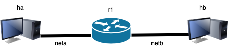
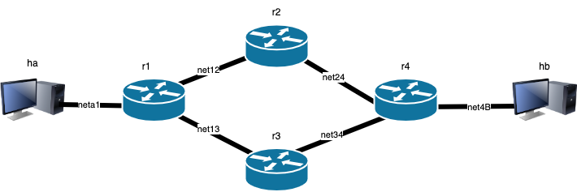

# LAB-K3. Basic topology and routing

## 1. Single server topology
Configure a topology in which router `r1` is connected to host `hb` on one
interface and to host `bg` on the other interface. 



Create a `lab.conf` file:

```shell
ha[0]="A"
ha[image]="kathara/base"

r1[0]="A"
r1[1]="B"
r1[image]="kathara/frr"

hb[0]="B"
hb[image]="kathara/base"
```
thus, `ha` and `hb` are connected on the same network.


Configure `ha`. Create a `ha.startup` file:
```shell
ip address add 192.168.1.1/24 dev eth0

ip route add default via 192.168.1.128 dev eth0
```

Configure `hb`. Create a `hb.startup` file:
```shell
ip address add 192.168.2.1/24 dev eth0

ip route add default via 192.168.2.128 dev eth0
```

Configure `r1`. Create a `r1.startup` file:
```shell
ip address add 192.168.1.128/24 dev eth0
ip address add 192.168.2.128/24 dev eth1
```
Run the lab through `kathara lstart` and test connectivity and performance

**Q1.1** Through `ip address`, report the IP address for all the interfaces (excluded the local loop).

**Q1.2** Through `ip route`, report the routing tables for `ha`, `hb` and `r1`.

**Q1.3** Report the three routing tables according to the following scheme:
| Network prefix | Gateway | Interface |
|---|---|---|
| ... |   |   |


**Q1.4** Through `ping`, report the output of the connectivity test between: `ha-r1`, `hb-R1`, `ha-hb`.

**Q1.5** Through `traceroute`, report the output of the route `ha->hb` and of the route `hb->ha`. Are the same? Why?

**Q1.6** Through `iperf3`, report the average bandwidth between `ha` and `hb`. Recall that `iperf3 -s` runs as server and `iperf3 -c X.X.X.X` runs as client sending the traffic towards `X.X.X.X`. 

## 2. Linear topology

Consider the topology below.


**Q2.1** Choose a proper addressing plan in order to minimize the waste of IP addresses, within the range 10.0.0.0/8. Assume that at most 1000 hosts could be connected to each network *neta1* and *netbB*. Fill the following table.


| Network | Network address|
| ---| ---|
| neta1  ||
|net12  |   |
| net2b| |

| Interface | IP address/netmask |
|---|--- |
| ha | |
| hb
| r1a | |
| r12 | |
| r21 | |
| r2b | |

**Q2.2** Configure the routing tables for each device. Fill the following table.

| Network prefix | Gateway | Interface |
|---|---|---|
|  ... |  |  |

**Q2.3** Show the routing path `ha->hb` and `hb->ha` through `traceroute`.

## 3. Routing in a loop topology

Consider the topology below.



**Q3.1** Choose a proper addressing plan in order to minimize the waste of IP addresses, within the range 10.0.0.0/8. Assume that at most 100 hosts could be connected to each network *neta1* and *net4b*. Fill the following table.

| Network | Network address|
| ---| ---|
| neta1  ||
|net12  |   |
|net24  |   |
|net13  |   |
|net34  |   |
| net4b| |

| Interface | IP address/netmask |
|---|--- |
| ha | |
| hb||
| r1a ||
| r12 | |
| r13 | |
| r21 ||
| r24 ||
| r31 ||
| r34||
| r42 ||
|r43||
|r4b||


**Q3.2** Configure the routing tables for each device such that *the traffic follow a clockwise direction within the loop* inside the topology. Fill the following table.

| Network prefix | Gateway | Interface |
|---|---|---|
|  ... |  |  |

**Q3.3** Show the output of `ping ` from `ha` to `hb` and vice versa.

**Q3.4** Show the output of `traceroute` for path `ha->hb` and for path `hb->ha`.

**Q3.5** (Optional) Show a routing table (as similar as possible to **Q3.2**) that would lead to a routing loop. For which destination IPs a routing loop will occur? 

**Q3.6** (Optional) Configure the routing table as in Q3.5 and show the effect of a routing loop using `ping` and `traceroute`. 

## 3. Routing in a loop topology (solution)

The network configuraton in ``lab.conf`` is the following:

```
ha[0]="neta1"
ha[image]="kathara/base"

hb[0]="net4b"
hb[image]="kathara/base"

r1[0]="neta1"
r1[1]="net12"
r1[2]="net13"
r1[image]="kathara/frr"

r2[0]="net12"
r2[1]="net24"
r2[image]="kathara/frr"

r3[0]="net13"
r3[1]="net34"
r3[image]="kathara/frr"

r4[0]="net4b"
r4[1]="net24"
r4[2]="net34"
r4[image]="kathara/frr"
```


**Q3.1**

| Network | Network address|
| ---| ---|
| neta1  |10.0.0.0/25|
|net12  | 10.0.1.0/30  |
|net24  | 10.0.1.8/30  |
|net13  | 10.0.1.4/30  |
|net34  | 10.0.1.12/30  |
| net4b|  10.0.0.128/25|

| Interface | IP address/netmask |
|---|--- |
| ha |10.0.0.1/25 |
| hb| 10.0.0.129|
| r1a |10.0.0.8/25|
| r12 | 10.0.1.1/30 |
| r13 | 10.0.1.5/30 |
| r21 | 10.0.1.2/30|
| r24 | 10.0.1.9/30|
| r31 | 10.0.1.6/30|
| r34|  10.0.1.13/30|
| r42 | 10.0.1.10/30 |
|r43|   10.0.1.14/30|
|r4b|   10.0.0.136/30|

**Q3.2**

We report the routing tables and the startup configuration file for each device. Note that it is enough to set the IP address of each network interface to get automatically the route entry for the corresponding network. 

**Host ha**

| Network prefix | Gateway | Interface |
|---|---|---|
|  10.0.0.0/25 | *  | eth0 |
| default/0 | 10.0.0.8 | eth0|

ha.startup:
```
ip address add 10.0.0.1/25 dev eth0

ip route add default via 10.0.0.8 dev eth0
```

**Host hb**

| Network prefix | Gateway | Interface |
|---|---|---|
|  10.0.0.128/25 | *  | eth0 |
| default/0 | 10.0.0.136 | eth0|

hb.startup:
```
ip address add 10.0.0.129/25 dev eth0

ip route add default via 10.0.0.136 dev eth0
```

**Router r1**

| Network prefix | Gateway | Interface |
|---|---|---|
|  10.0.0.0/25 | *  | eth0 |
| 10.0.1.0/30 | * | eth1 |
| 10.0.1.4/30 | * | eth2 |
| default/0 | 10.0.1.2 | eth1|

r1.startup:
```
ip address add 10.0.0.8/25 dev eth0
ip address add 10.0.1.1/30 dev eth1
ip address add 10.0.1.5/30 dev eth2

ip route add default via 10.0.1.2
```

**Router r2**
| Network prefix | Gateway | Interface |
|---|---|---|
|  10.0.1.0/30 | *  | eth0 |
| 10.0.1.8/30 | * | eth1 |
| 10.0.0.0/25 | 10.0.1.1 | eth0 |
| default/0 | 10.0.1.10 | eth1|

r2.startup:
```
ip address add 10.0.1.2/30 dev eth0
ip address add 10.0.1.9/30 dev eth1

ip route add 10.0.0.0/25 via 10.0.1.1
ip route add default via 10.0.1.10
```

**Router r3**
| Network prefix | Gateway | Interface |
|---|---|---|
|  10.0.1.4/30 | *  | eth0 |
| 10.0.1.12/30 | * | eth1 |
| 10.0.0.128/25 | 10.0.1.14 | eth1 |
| default/0 | 10.0.1.5 | eth0|


r3.startup:
```
ip address add 10.0.1.6/30 dev eth0
ip address add 10.0.1.13/30 dev eth1

ip route add 10.0.0.128/25 via 10.0.1.14
ip route add default via 10.0.1.5
```

**Router r4**
| Network prefix | Gateway | Interface |
|---|---|---|
|  10.0.0.128/25 | *  | eth0 |
| 10.0.1.8/30 | * | eth1 |
| 10.0.1.12/30 | * | eth2 |
| 10.0.0.0/25 | 10.0.1.13 | eth2|

r4.startup:
```
ip address add 10.0.0.136/25 dev eth0
ip address add 10.0.1.10/30 dev eth1
ip address add 10.0.1.14/30 dev eth2

ip route add 10.0.0.0/25 via 10.0.1.13
```

**Q3.3** 

The ```ping``` command highlights a 3 hops between ``ha`` and ``hb`` since the TTL is 61 (i.e., 64-3).

```
root@ha:/# ping 10.0.0.129 -c 1
PING 10.0.0.129 (10.0.0.129) 56(84) bytes of data.
64 bytes from 10.0.0.129: icmp_seq=1 ttl=61 time=5.60 ms

--- 10.0.0.129 ping statistics ---
1 packets transmitted, 1 received, 0% packet loss, time 0ms
rtt min/avg/max/mdev = 5.597/5.597/5.597/0.000 ms
```

```
root@hb:/# ping 10.0.0.1 -c 1
PING 10.0.0.1 (10.0.0.1) 56(84) bytes of data.
64 bytes from 10.0.0.1: icmp_seq=1 ttl=61 time=3.70 ms

--- 10.0.0.1 ping statistics ---
1 packets transmitted, 1 received, 0% packet loss, time 0ms
rtt min/avg/max/mdev = 3.697/3.697/3.697/0.000 ms
```


**Q3.4**


```
root@hb:/# traceroute  10.0.0.1 
traceroute to 10.0.0.1 (10.0.0.1), 30 hops max, 60 byte packets
 1  10.0.0.136 (10.0.0.136)  1.735 ms  2.533 ms  3.039 ms
 2  10.0.1.13 (10.0.1.13)  4.708 ms  5.022 ms  5.597 ms
 3  10.0.1.1 (10.0.1.1)  7.270 ms  7.675 ms  8.134 ms
 4  10.0.0.1 (10.0.0.1)  8.375 ms  8.737 ms  9.540 ms
 ```

```
 root@ha:/# traceroute 10.0.0.129 
traceroute to 10.0.0.129 (10.0.0.129), 30 hops max, 60 byte packets
 1  10.0.0.8 (10.0.0.8)  1.365 ms  1.682 ms  2.138 ms
 2  10.0.1.2 (10.0.1.2)  3.517 ms  3.991 ms  4.427 ms
 3  10.0.1.14 (10.0.1.14)  5.024 ms  5.171 ms  5.532 ms
 4  10.0.0.129 (10.0.0.129)  7.220 ms  7.751 ms  8.281 ms
```

**Q3.5**
To generate a loop, it is enough to substitute the following entry in the routing table of **r4**:

| Network prefix | Gateway | Interface |
|---|---|---|
| ... | ...| ...|
| 10.0.0.0/25 | 10.0.1.13 | eth2|

with 

| Network prefix | Gateway | Interface |
|---|---|---|
| ... | ...| ...|
| default/0 | 10.0.1.13 | eth2|


Now pinging an external IP address, a loop will be generated:
```
root@ha:/# ping 1.2.3.4 -c 1
PING 1.2.3.4 (1.2.3.4) 56(84) bytes of data.
From 10.0.1.6 icmp_seq=1 Time to live exceeded

--- 1.2.3.4 ping statistics ---
1 packets transmitted, 0 received, +1 errors, 100% packet loss, time 0ms
```

Similarly, ```traceroute``` will highlight a loop:  
```
root@ha:/# traceroute  1.2.3.4 
traceroute to 1.2.3.4 (1.2.3.4), 30 hops max, 60 byte packets
 1  10.0.0.8 (10.0.0.8)  1.109 ms  1.636 ms  2.639 ms
 2  10.0.1.2 (10.0.1.2)  3.137 ms  3.685 ms  5.202 ms
 3  10.0.1.14 (10.0.1.14)  7.017 ms  7.976 ms  8.352 ms
 4  10.0.1.6 (10.0.1.6)  9.900 ms  10.323 ms  10.599 ms
 5  10.0.0.8 (10.0.0.8)  10.604 ms  11.645 ms  11.933 ms
 6  10.0.1.2 (10.0.1.2)  12.266 ms  11.558 ms  11.658 ms
 ...

 