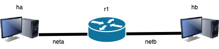

# LAB-K3. Basic topology and routing

## 1. Single router topology
Configure a topology in which router `r1` is connected to host `hb` on one
interface and to host `bg` on the other interface. 



Create a `lab.conf` file:

```shell
ha[0]="neta"
ha[image]="kathara/base"

r1[0]="neta"
r1[1]="netb"
r1[image]="kathara/frr"

hb[0]="netb"
hb[image]="kathara/base"
```
thus, `ha` and `hb` are connected on the same network.


Configure `ha`. Create a `ha.startup` file:
```shell
ip address add 192.168.1.1/24 dev eth0

ip route add default via 192.168.1.128 dev eth0
```

Configure `hb`. Create a `hb.startup` file:
```shell
ip address add 192.168.2.1/24 dev eth0

ip route add default via 192.168.2.128 dev eth0
```

Configure `r1`. Create a `r1.startup` file:
```shell
ip address add 192.168.1.128/24 dev eth0
ip address add 192.168.2.128/24 dev eth1
```
Run the lab through `kathara lstart` and test connectivity and performance

**Q1.1** Through `ip address`, report the IP address for all the interfaces (excluded the local loop).

**Q1.2** Through `ip route`, report the routing tables for `ha`, `hb` and `r1`.

**Q1.3** Report the three routing tables according to the following scheme:
| Network prefix | Gateway | Interface |
|---|---|---|
| ... |   |   |


**Q1.4** Through `ping` with a single ICMP packet, report the output of the connectivity test between: `ha-r1`, `hb-R1`, `ha-hb`.

**Q1.5** Through `traceroute`, report the output of the route `ha->hb` and of the route `hb->ha`. Are the same? Why?

**Q1.6** Through `iperf3`, report the average bandwidth between `ha` and `hb`. Recall that `iperf3 -s` runs as server and `iperf3 -c X.X.X.X` runs as client sending the traffic towards `X.X.X.X`. 


