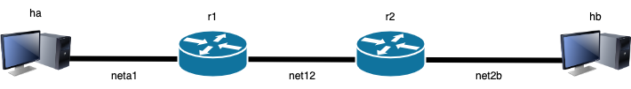

# LAB-K3. Basic topology and routing

## 1. Single server topology
Configure a topology in which router `R1` is connected to host `HA` on one
interface and to host `HB` on the other interface. 


Create a `lab.conf` file:

```shell
HA[0]="A"
HA[image]="kathara/base"

R1[0]="A"
R1[1]="B"
R1[image]="kathara/frr"

HB[0]="B"
HB[image]="kathara/base"
```
thus, `HA` and `HB` are connected on the same network.


Configure `HA`. Create a `HA.startup` file:
```shell
ip address add 192.168.1.1/24 dev eth0

ip route add default via 192.168.1.128 dev eth0
```

Configure `HB`. Create a `HB.startup` file:
```shell
ip address add 192.168.2.1/24 dev eth0

ip route add default via 192.168.2.128 dev eth0
```

Configure `R1`. Create a `R1.startup` file:
```shell
ip address add 192.168.1.128/24 dev eth0
ip address add 192.168.2.128/24 dev eth1
```
Run the lab through `kathara lstart` and test connectivity and performance

**Q1.1** Through `ip address`, report the IP address for all the interfaces (excluded the local loop).

**Q1.2** Through `ip route`, report the routing tables for `HA`, `HB` and `R1`.

**Q1.3** Report the three routing tables according to the following scheme:
| Network prefix | Gateway | Interface |
|---|---|---|
| ... |   |   |


**Q1.4** Through `ping`, report the output of the connectivity test between: `HA-R1`, `HB-R1`, `HA-HB`.

**Q1.5** Through `traceroute`, report the output of the route `HA->HB` and of the route `HB->HA`. Are the same? Why?

**Q1.6** Through `iperf3`, report the average bandwidth between `HA` and `HB`. Recall that `iperf3 -s` runs as server and `iperf3 -c X.X.X.X` runs as client sending the traffic towards `X.X.X.X`. 

## 2. Linear topology

Consider the topology below.




**Q2.1** Choose a proper addressing plan in order to minimize that waste of IP addresses, within the range 10.0.0.0/8. Assume that at most 1000 hosts could be connected to *netA1* and to *net2B*. Fill the following table.


| Network | Network prefix|
| ---| ---|
| netA1  ||
|net12  |   |
| net2B| |

| Interface | IP address/netmask |
|---|--- |
| HA | |
| HB
| R1A | |
| R12 | |
| R21 | |
| R2B | |

**Q2.2** Configure the routing tables for each device. Fill the following table.

| Network prefix | Gateway | Interface |
|---|---|---|
|  ... |  |  |

**Q2.3** Show the routing path `HA->HB` and `HB->HA` through `traceroute`.

## 3. Routing in a loop topology

Consider the topology below.


**Q3.1** Choose a proper addressing plan in order to minimize that waste of IP addresses, within the range 10.0.0.0/8. Assume that at most 100 hosts could be connected to *netA1* and to *net4B*. Fill the following table.

| Network | Network prefix|
| ---| ---|
| netA1  ||
|net12  |   |
|net24  |   |
|net13  |   |
|net34  |   |
| net4B| |

| Interface | IP address/netmask |
|---|--- |
| HA | |
| HB
| R1A ||
| R12 | |
| R13 | |
| R21 ||
| R24 ||
| R31 ||
| R34||
| R42 ||
|R43||
|R4B||


**Q3.2** Configure the routing tables for each device such that *the traffic follow a clockwise direction within the loop* inside the topology. Fill the following table.

| Network prefix | Gateway | Interface |
|---|---|---|
|  ... |  |  |

**Q3.3** Show the output of `ping ` from `HA` to `HB` and vice versa.

**Q3.4** Show the output of `traceroute` for path `HA->HB` and for path `HB->HA`.

**Q3.5** (Optional) Show a routing table (as similar as possible to **Q3.2**) that would lead to a routing loop. For which destination IPs a routing loop will occur? 

**Q3.6** (Optional) Configure the routing table as in Q3.5 and show the effect of a routing loop using `ping` and `traceroute`. 


