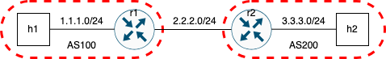
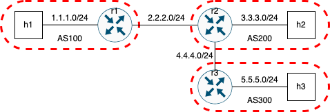
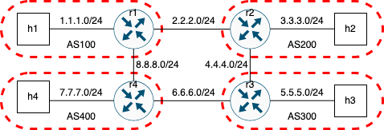

# LAB-K4. BGP


## 4.1 Summary of the steps to emulate a network with BGP 

The main steps to follow to perform a completely new lab on BGP is the following:
1. Create a `lab.conf` file with the topology and the images of each node. The router image should be `frr` as in the following example: `rX[image]="kathara/frr"` 
2. Create a `rX.startup` file for each router (say `rX`), assigning the IP address for each interface. Typically, you do not have to set the routing tables, since they will be computed by the routing protocol. Add also a line with `systemctl start frr` to start the routing daemon. See the [rX.config](template/rX.startup) template
3. Create, for each router (say `rX`), a folder sequence as `rX/etc/frr/` and with all the following files:
  * a file `daemons` with all the options required to start the routing daemaons. Use the [daemons](template/rX/etc/frr/daemons) template
  * a file `vtysh.conf` to configure the shell used to interact with BGP daemon `bgpd`. In particular, you must change the hostname into `hostname rX-frr` with the proper `rX`.
  * a file `frr.conf` to configure BGP. This is the most important file to modify to control the behavior of BGP. Use the [frr.conf](template/rX/etc/frr/frr.conf) template.
4. Start the lab as usual using `kathara lstart`


## 4.2 Useful commands in vtysh

On the terminal of any BGP router, you can start `vtysh` to get detailed information from BGP deamon. The full documention is available on [https://docs.frrouting.org/en/latest/bgp.html](https://docs.frrouting.org/en/latest/bgp.html) under the section _Displaying BGP Information_. The main commands are the following:

- `show ip route`: routing tables (important)
- `show ip bgp`: AS paths (important) 
- `show bgp neighbors`: neighbors
- `show ip bgp A.B.C.D` 
- `show bgp all`
- `show bgp all detail`

## 4.3 Peerring between two routers


As preliminary step, study the [slides on BGP peering](bgp-simple-peering/041-kathara-lab_bgp-simple-peering.pdf)
and perfom the whole activity proposed in the slides. 

Now start a new lab in a new folder implementing the following topology:



with the following IP addressing plan.

| Interface | IP address/netmask |
|---|--- |
| h1-eth0 |1.1.1.1/24 |
| h2-eth0| 3.3.3.1/24 |
| r1-eth0| 1.1.1.10/24|
| r1-eth1| 2.2.2.10/24|
| r2-eth0| 2.2.2.20/24|
| r2-eth1| 3.3.3.20/24|

Answer to the following questions:

1. Configure the proper name of the two ASs. Which file/s you modified?
2. Start the lab. Check for both routers the routing tables with both `route` and `ip route`. Are the obtained info equivalent?
1. Looking at the `log` file of BGP, how often the KEEPALIVE message is sent among the routers?
1. Instead of using `telnet`, use `vtysh` to access the command line interface of `bgpd`. What you learn from the output of `show ip bgp`? You can exit `vtysh` by typing `exit`.
1. What you learn from the output of `show ip summary`?
1. Try to ping `h2` from `h1`. Does it work? Why?

## 4.4 BGP Announcements with 2 ASs

As preliminary step, study the [slides on BGP announcement](bgp-announcement/042-kathara-lab_bgp-announcement.pdf)
and perfom the whole activity proposed in the slides.

Now start a new lab in a new folder implementing the following topology:


with the IP addressing plan of section 4.3.

Answer to the following questions:
1. Report the output `show ip route` within `vtysh` and the output of `route` for each router. Is the information the same? If not, what are the differences?
1. Try to ping `h2` from `h1`. Does it work? Why?
1. Consider the log file of frr in each router. Report the line of the log with announcements sent from the router and the announcements received at the router.
1. Report the AS paths in each router shown with `show ip bgp`. Fill also the following table:

| Network prefix | AS path |
|---|---|
| ... | ...|

## 4.4 (Partial solution)

### r1 Routing tables and AS paths


```shell
root@r1:/# ip route
1.1.1.0/24 dev eth0 proto kernel scope link src 1.1.1.11 
2.2.2.0/24 dev eth1 proto kernel scope link src 2.2.2.11 
3.3.3.0/24 nhid 6 via 2.2.2.12 dev eth1 proto bgp metric 20 
```
Thus, router r1 is aware of the routes to reach the direct delivery networks and the routes to reach 3.3.3.0/24 through 2.2.2.12. 

```shell
r1-frr# show ip bgp 
BGP table version is 2, local router ID is 2.2.2.11, vrf id 0
Default local pref 100, local AS 100
...
    Network          Next Hop            Metric LocPrf Weight Path
 *> 1.1.1.0/24       0.0.0.0                  0         32768 i
 *> 3.3.3.0/24       2.2.2.12                 0             0 200 i

Displayed  2 routes and 2 total paths
```

Thus, the AS path identified by BGP is:
3.3.3.0/24 AS200.

### r2 Routing tables and AS paths

```shell
root@r2:/# ip route
1.1.1.0/24 nhid 6 via 2.2.2.11 dev eth0 proto bgp metric 20 
2.2.2.0/24 dev eth0 proto kernel scope link src 2.2.2.12 
3.3.3.0/24 dev eth1 proto kernel scope link src 3.3.3.12 
```
Thus, router r2 is aware of the routes to reach the direct delivery networks and the routes to reach 1.1.1.0/24 through 2.2.2.11.


```shell
r2-frr# show ip bgp
BGP table version is 2, local router ID is 3.3.3.12, vrf id 0
Default local pref 100, local AS 200
...
    Network          Next Hop            Metric LocPrf Weight Path
 *> 1.1.1.0/24       2.2.2.11                 0             0 100 i
 *> 3.3.3.0/24       0.0.0.0                  0         32768 i

Displayed  2 routes and 2 total paths
```

Thus, the AS path identified by BGP is:
1.1.1.0/24 AS100.


### Connectivity h1->h2


```shell
root@h1:/# ping 3.3.3.1 -c 1
PING 3.3.3.1 (3.3.3.1) 56(84) bytes of data.
64 bytes from 3.3.3.1: icmp_seq=1 ttl=62 time=4.33 ms

--- 3.3.3.1 ping statistics ---
1 packets transmitted, 1 received, 0% packet loss, time 0ms
rtt min/avg/max/mdev = 4.332/4.332/4.332/0.000 ms
root@h1:/# traceroute 3.3.3.1
traceroute to 3.3.3.1 (3.3.3.1), 30 hops max, 60 byte packets
 1  1.1.1.11 (1.1.1.11)  1.018 ms  1.356 ms  1.555 ms
 2  2.2.2.12 (2.2.2.12)  2.034 ms  2.929 ms  3.251 ms
 3  3.3.3.1 (3.3.3.1)  3.593 ms  4.492 ms  4.719 ms
 ```

`ping` shows the connectivity between the two hosts and `traceroute` shows the router "entering" interfaces along the path.

### Connectivity h2->h1

```shell
root@h2:/# ping 1.1.1.1 -c 1
PING 1.1.1.1 (1.1.1.1) 56(84) bytes of data.
64 bytes from 1.1.1.1: icmp_seq=1 ttl=62 time=3.41 ms

--- 1.1.1.1 ping statistics ---
1 packets transmitted, 1 received, 0% packet loss, time 0ms
rtt min/avg/max/mdev = 3.409/3.409/3.409/0.000 ms
root@h2:/# traceroute 1.1.1.1
traceroute to 1.1.1.1 (1.1.1.1), 30 hops max, 60 byte packets
 1  3.3.3.12 (3.3.3.12)  1.060 ms  1.451 ms  1.451 ms
 2  2.2.2.11 (2.2.2.11)  2.451 ms  4.864 ms  4.887 ms
 3  1.1.1.1 (1.1.1.1)  6.426 ms  6.721 ms  6.612 ms
```
`ping` shows the connectivity between the two hosts and `traceroute` shows the router "entering" interfaces along the path. Such interfaces are complementary with repect to the interfaces identified in the previous case.

## 4.5 BGP Announcements with a linear topology

Now start a new lab in a new folder implementing the following topology:



with the IP addressing plan of section 4.3,  plus the following interfaces:
| Interface | IP address/netmask |
|---|--- |
| r2-eth2| 4.4.4.20/24|
| r3-eth0| 4.4.4.30/24|
| r3-eth1| 5.5.5.3/24|

1. Report the routes in each router shown with `show ip route`. Are they correct? Why?
1. Try to ping `h2` and `h3` from `h1`. Does it work? Why?
1. Report the AS paths in each router shown with `show ip bgp`. Fill also the following table:

| Network prefix | AS path |
|---|---|
| ... | ...|


## 4.6 (Optional) BGP Announcements for a loop topology

Now start a new lab in a new folder implementing the following topology:



1. Configure all the IP addresses.

2. Check if BGP is able to compute properly the routing tables.

1. Report the routing tables with `show ip route`. Is there any routing loop?

1. Report the AS paths with `show ip bgp`. Are all the paths considered.

1. Comment about the capability of BGP of managing routing loops.


