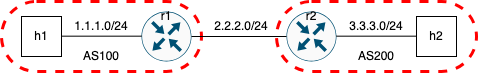

# LAB-K4. BGP

## 4.1 Summary of the steps to emulate a network with BGP 

> [!TIP]
> Under the folder `template/` it is possible to find a template for a single router `rX`. From the folder `LAB-K4`, you can copy the template by: `cp -r template/ LAB_FOLDER` where `LAB_FOLDER` is your lab folder. Read the detailed instructions below before doing it.

The main steps to follow to perform a completely new lab on BGP is the following:

1. Create a new folder for your lab and enter it with the terminal. 
1. Create a `lab.conf` file with the topology and the images of each node. The router image should be `frr` as in the following example: `rX[image]="kathara/frr"` 
2. Create a `rX.startup` file for each router (say `rX`), assigning the IP address for each interface. Typically, you do not have to set the routing tables, since they will be computed by the routing protocol. Add also a line with `systemctl start frr` to start the routing daemon. See the [rX.config](template/rX.startup) template
3. Create, for each router (say `rX`), a folder sequence as `rX/etc/frr/` and with all the following files:
  * a file `daemons` with all the options required to start the routing daemaons. Use the [daemons](template/rX/etc/frr/daemons) template
  * a file `vtysh.conf` to configure the shell used to interact with BGP daemon `bgpd`. In particular, you must change the hostname into `hostname rX-frr` with the proper `rX`.
  * a file `frr.conf` to configure BGP. This is the most important file to modify to control the behavior of BGP. Use the [frr.conf](template/rX/etc/frr/frr.conf) template.
4. Start the lab as usual using `kathara lstart`

## 4.2 Useful commands in vtysh

On the terminal of any BGP router, you can start `vtysh` to get detailed information from BGP deamon. The full documention is available on [https://docs.frrouting.org/en/latest/bgp.html](https://docs.frrouting.org/en/latest/bgp.html) under the section _Displaying BGP Information_. The main commands are the following:

- `show ip route`: routing tables (important)
- `show ip bgp`: AS paths (important)
- `show ip bgp summary` 
- `show bgp neighbors`: neighbors
- `show ip bgp A.B.C.D`: show the routing decision to reach IP address `A.B.C.D` 
- `show bgp all`
- `show bgp all detail`

## 4.3 BGP peering with 2 ASs

As preliminary step, just study the [slides on BGP peering](bgp-simple-peering/041-kathara-lab_bgp-simple-peering.pdf)
without performing the activity proposed in the slide. 

Now start a new lab in a new folder implementing the following topology:

with `r1` and `r2` two BGP-enabled routers.  Only the peering between `r1` and `r2` must be enabled, without any announcement.

The following IP addressing plan is adopted.

| Interface | IP address/netmask |
|---|--- |
| h1-eth0 |1.1.1.1/24 |
| h2-eth0| 3.3.3.1/24 |
| r1-eth0| 1.1.1.10/24|
| r1-eth1| 2.2.2.10/24|
| r2-eth0| 2.2.2.20/24|
| r2-eth1| 3.3.3.20/24|

Answer to the following questions:

1. Configure the proper name of the two ASs. Which file/s you modified?
2. Start the lab. Check for both routers the routing tables with both `route` and `ip route`. Are the obtained info equivalent?
1. Looking at the `log` file of BGP, how often the KEEPALIVE message is sent among the routers?
1. Instead of using `telnet`, use `vtysh` to access the command line interface of `bgpd`. What you learn from the output of `show ip bgp`? You can exit `vtysh` by typing `exit`.
1. What you learn from the output of `show ip bgp summary`?
1. Try to ping `h2` from `h1`. Does it work? Why?

## 4.4 BGP Announcements with 2 ASs

As preliminary step, study the [slides on BGP announcement](bgp-announcement/042-kathara-lab_bgp-announcement.pdf)
and perfom the whole activity proposed in the slides.

Now start a new lab in a new folder implementing the following topology:

with the IP addressing plan of section 4.3. 
Again, `r1` and `r2` are two BGP-enabled routers.

Answer to the following questions:
1. Report the output `show ip route` within `vtysh` and the output of `route` for each router. Is the information the same? If not, what are the differences?
1. Try to ping `h2` from `h1`. Does it work? Why?
1. Consider the log file of frr in each router. Report the line of the log with announcements sent from the router and the announcements received at the router.
1. Report the AS paths in each router shown with `show ip bgp`. Fill also the following table:

| Network prefix | AS path |
|---|---|
| ... | ...|

