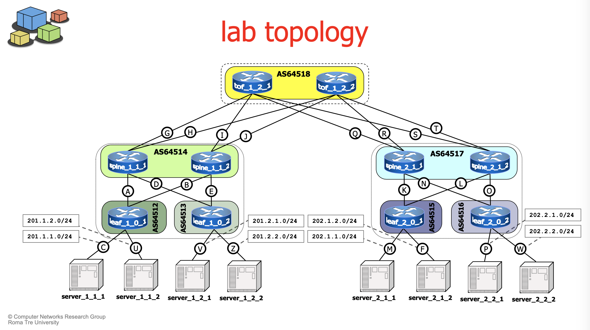

# LAB-K5. BGP in a data center

## K5.1 Multilayer data center (configuration)

As preliminary step, study the [slides on BGP peering](./data-center-bgp/051-kathara-lab_data-center-bgp.pdf)

The topology figure is reported below:

Before running the lab:

1. Check the files in the [lab folder](./data-center-bgp/kathara-lab_data-center-bgp/). As a suggestion, a simple way to access the file from the root folder of the lab is to use the command `cat`. E.g., `cat lab.conf`, `cat tof*startup`, `cat tof_1_2_*/etc/frr/bgpd.conf`. Use `[TAB]` for autocompletion!
To evaluate the differences between file configurations, exploit `diff`. E.g., `diff spine_1_1_1.startup leaf_1_0_1.startup`,`diff tof_1_2_1/etc/frr/bgpd.conf tof_1_2_2/etc/frr/bgpd.conf`. To scan across multiple files and identify some specific lines, use `grep`. E.g., `grep peer-group */etc/frr/bgpd.conf` or `grep peer-group */etc/frr/bgpd.conf|grep -v interface`.
1. Find the local id of each interface for all the topology (e.g., eth0, eth1) and report in the topology figure. How did you discover such information?
1. Check the startup file of each device. What are the interfaces for which the IP addresses have been configured?
1. Just based on the startup file, how the configuration of a router differs from the one of an host? 
1. Report in the topology figure the router id used by BGP for each device.
1. What are the differences in the BGP configuration of the two ToF routers?
1. What are the three different ECMP policies that can be selected? How do they differ?
1. Show in the topology figure the name of the peer group associated to each interface.
1. Considering just the topology, compute what would be the AS paths for the three specific routers shown in the table

 Router | Network prefix | AS path
----|---|---|
tof_1_2_1|202.1.1.0/24| |
spine_1_1_1|202.1.1.0/24||
leaf_1_0_1|202.1.1.0/24||

## K5.2 Multilayer data center (running)

Now run the lab.

9. With `ping ... -c 1`, check the connectivity between two pairs of servers and show the results.
10. Show the routing tables with `show ip bgp` within a leaf router, a spine router and a tof router. Comment the paths that are shown.
11. Send the traffic from the servers attached to leaf_1_0_1 to the servers attached to leaf_2_0_2. Find a way to show that ECMP exploits different paths. Describe the methodology and the results you obtain.

## K5.3 Failures (optional)

12. While operating the datacenter, emulate failures with `ip link set ethX down` (where `ethx` is a proper interface name).
13. What happens at BGP level? Is there any impact on the AS paths?
1. What happens on the traffic? Is there any impact on the connectivity between two servers?

